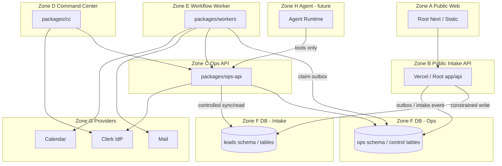

# DeinTarifHeld — Canonical Runtime Architecture

STATUS=PROPOSED_M9  
AS_OF=2026-08-13  
BASELINE=4545c7b95ede83c952b7086f8073b19b747f20af (M8C)  
M9_GATE=PENDING_OWNER_REVIEW  
IMPLEMENTATION_AUTHORIZED=NO  

## Selected architecture

```text
ARCHITECTURE_ID=DTH-ERA-A
ARCHITECTURE_NAME=Evolutionary Dual-Plane
M9R=PASS (hardening applied; freeze pending Owner)
```

**Public plane (canonical, live):** Repo-root Next.js (+ Vercel Lead API / Checkdomain static as today).  
**Ops plane (canonical, target):** `packages/ops-api`, `packages/cc`, `packages/workers`, `packages/shared`, `packages/db`.  
**Non-canonical:** `packages/web`, `packages/api` skeletons → deprecate (no migration of live public into them without proven benefit).

**Domain vs transport (M9R):**  
- CC → Ops API (HTTP) → Domain Service  
- Agent → Tool Gateway → Ops API → Domain Service  
- Worker → Domain Service directly (trusted backend; same policy/audit/final-control rules; **not** required to HTTP-hairpin)

This is a **strangler / evolutionary** decision: do **not** move working public production into packages for aesthetic consistency.


## Binding principles (accepted)

| ID | Principle | Status |
|---|---|---|
| P1 | One canonical owner per runtime responsibility | ACCEPT |
| P2 | No duplicate production business logic across root and packages | ACCEPT |
| P3 | Public intake and Ops are separate trust zones | ACCEPT |
| P4 | Authentication ≠ authorization | ACCEPT |
| P5 | Human authorization server-enforced | ACCEPT |
| P6 | DB controls are defense-in-depth, not a substitute for service AuthZ | ACCEPT |
| P7 | Privileged service credentials minimized and isolated | ACCEPT |
| P8 | Agents never receive blanket infrastructure credentials | ACCEPT |
| P9 | Agent actions pass normal domain AuthZ | ACCEPT |
| P10 | External actions auditable | ACCEPT |
| P11 | Durable production control state ≠ process memory | ACCEPT |
| P12 | Tolerate restart and multi-instance | ACCEPT |
| P13 | Automation individually stoppable | ACCEPT |
| P14–P15 | Idempotent workflows; retries + DLQ | ACCEPT |
| P16 | Human takeover | ACCEPT |
| P17 | Prod data not required for test/staging | ACCEPT |
| P18 | Explicit environment separation | ACCEPT |
| P19 | Minimize new infra until required | ACCEPT |
| P20 | No microservices without demonstrated need | ACCEPT |

Rejected: none of the above.

## Target topology (Mermaid)



## Current → Target (no big bang)

| Phase | State |
|---|---|
| CURRENT | Root public LIVE; packages Ops LOCAL; dual plane unresolved |
| TRANSITION_1 | Freeze public as-is; harden Ops packages as sole Ops runtime; deprecate web/api skeletons; durable control tables designed (M10) |
| TRANSITION_2 | Staging dual-plane; constrained intake credential; outbox handoff; durable session/kill; AuthZ+RLS |
| TARGET | Same dual-plane; public never depends on CC/AI; workers durable; agents via Ops tools only |

## Key decisions (see ADRs)

- Public runtime stays root Next — [ADR-001](../architecture/adr/ADR-001.md)
- Ops runtime = packages ops-api/cc/workers/shared/db — [ADR-002](../architecture/adr/ADR-002.md)
- Deployments separate public vs ops — [ADR-003](../architecture/adr/ADR-003.md)
- Public→Ops via durable intake + async processing — [ADR-004](../architecture/adr/ADR-004.md)
- DB access via APIs; no browser/agent→DB — [ADR-005](../architecture/adr/ADR-005.md)
- Credential matrix / no blanket service_role — [ADR-006](../architecture/adr/ADR-006.md)
- Session state: Postgres-backed (not Redis-first) — [ADR-007](../architecture/adr/ADR-007.md)
- Kill switch: Postgres-backed, fail-closed for automation — [ADR-008](../architecture/adr/ADR-008.md)
- Workflow: Postgres + worker first — [ADR-009](../architecture/adr/ADR-009.md)
- CC separate deployable — [ADR-010](../architecture/adr/ADR-010-command-center-boundary.md)
- Ops API = BFF + domain API for humans/workers/agents — [ADR-011](../architecture/adr/ADR-011.md)
- Agents = tools→policy→AuthZ — [ADR-012](../architecture/adr/ADR-012-agent-tool-boundary.md)
- External actions = outbox + readback — [ADR-013](../architecture/adr/ADR-013.md)
- Environments LOCAL/TEST/STAGING/PROD — [ADR-014](../architecture/adr/ADR-014-environment-topology.md)
- Audit + correlation IDs — [ADR-015](../architecture/adr/ADR-015.md)
- Migration ownership boundary vs M10 — [ADR-016](../architecture/adr/ADR-016-migration-ownership.md)

## Architecture invariants (target constraints — not current implementation claims)

```text
PUBLIC_WEB_CANNOT_ACCESS_OPS_DATA_DIRECTLY
PUBLIC_INTAKE_CANNOT_READ_ARBITRARY_CUSTOMER_DATA
CC_REQUIRES_PERSON_AUTHENTICATION
CC_REQUIRES_SERVER_AUTHORIZATION
AGENT_CANNOT_USE_HUMAN_SESSION
AGENT_CANNOT_HOLD_SERVICE_ROLE
AGENT_CANNOT_SEND_EXTERNAL_ACTION_WITHOUT_POLICY
UNKNOWN_PRINCIPAL_DENY
AUTOMATION_STATE_MUST_BE_DURABLE
KILL_SWITCH_MUST_BE_DURABLE
PUBLIC_LEAD_ACCEPTANCE_MUST_NOT_REQUIRE_AI
PUBLIC_LEAD_ACCEPTANCE_MUST_NOT_REQUIRE_CC
EXTERNAL_ACTION_MUST_BE_IDEMPOTENT
EXTERNAL_ACTION_MUST_BE_AUDITABLE
PRODUCTION_DATA_MUST_NOT_BE_REQUIRED_FOR_STAGING
SERVICE_ROLE_USAGE_MUST_BE_EXPLICITLY_SCOPED
NO_EXTERNAL_ACTION_WITHOUT_FRESH_CONTROL_CHECK
HUMAN_TAKEOVER_INVALIDATES_STALE_AUTOMATION
PROVIDER_CALL_MUST_NOT_PRECEDE_DURABLE_INTENT
NO_GENERAL_SERVICE_ROLE_FOR_AGENT
NO_GENERAL_SERVICE_ROLE_FOR_CC
PUBLIC_INTAKE_HAS_MINIMUM_DB_CAPABILITY
AUDIT_MUST_NOT_BE_DESCRIBED_AS_IMMUTABLE_UNLESS_PROVEN
AUTH_PROVIDER_STATE_AND_DTH_POLICY_STATE_HAVE_EXPLICIT_AUTHORITIES
WORKER_FAILURE_MUST_NOT_LOSE_ACCEPTED_LEAD
PROVIDER_TIMEOUT_MUST_NOT_CAUSE_BLIND_DUPLICATE_RETRY
M10_DATA_TOPOLOGY_MUST_PRESERVE_DURABLE_PUBLIC_TO_OPS_HANDOFF
CLERK_AUTHENTICATED_DOES_NOT_IMPLY_DTH_SESSION_ALLOWED
WORKER_USES_DOMAIN_SERVICE_NOT_REQUIRED_HTTP_HAIRPIN
NO_GENERAL_PURPOSE_SERVICE_ROLE_IN_NORMAL_PUBLIC_REQUEST_PATH
```

## Clerk vs DTH session (M9R)

```text
CLERK_AUTHORITY=identity + AuthN + provider session
DTH_SESSION_AUTHORITY=admission, inactivity, max lifetime, max-one, local revocation, disablement deny
```

Local DTH deny is immediate and must not wait for Clerk API success.

## External action pattern (M9R corrected)

```text
Command → Policy/AuthZ → Domain Transaction (+ outbox intent) → COMMIT
→ Dispatcher → Provider Adapter → Provider → Readback → Reconciliation
```

## Public→Ops handoff (M10-compatible)

Same DB: lead+source_outbox same transaction.  
Separate DBs: public durable + source outbox → relay → Ops idempotent inbox (no XA).

## M9 / M10 boundary

**M9 decides:** runtimes, deploy/trust/credential boundaries, control-state & workflow architecture classes, high-level DB access.  
**M10 decides:** canonical data model, SoT, schemas, lead→case semantics, retention mechanics, detailed migration plan.

## M9F CANONICAL INVARIANT SET

```text
PUBLIC_WEB_CANNOT_ACCESS_OPS_DATA_DIRECTLY
PUBLIC_INTAKE_CANNOT_READ_ARBITRARY_CUSTOMER_DATA
PUBLIC_INTAKE_HAS_MINIMUM_DB_CAPABILITY
CC_REQUIRES_PERSON_AUTHENTICATION
CC_REQUIRES_SERVER_AUTHORIZATION
CC_CANNOT_HOLD_GENERAL_SERVICE_ROLE
AGENT_CANNOT_USE_HUMAN_SESSION
AGENT_CANNOT_HOLD_GENERAL_SERVICE_ROLE
AGENT_CANNOT_CALL_PROVIDER_ADAPTER_DIRECTLY
AGENT_CANNOT_ESCALATE_CAPABILITY_VIA_PROMPT
UNKNOWN_PRINCIPAL_DENY
AUTH_PROVIDER_STATE_AND_DTH_POLICY_STATE_HAVE_EXPLICIT_AUTHORITIES
AUTOMATION_STATE_MUST_BE_DURABLE
KILL_SWITCH_MUST_BE_DURABLE
PUBLIC_LEAD_ACCEPTANCE_MUST_NOT_REQUIRE_AI
PUBLIC_LEAD_ACCEPTANCE_MUST_NOT_REQUIRE_CC
WORKER_FAILURE_MUST_NOT_LOSE_ACCEPTED_LEAD
PROVIDER_CALL_MUST_NOT_PRECEDE_DURABLE_INTENT
PROVIDER_TIMEOUT_MUST_NOT_CAUSE_BLIND_DUPLICATE_RETRY
EXTERNAL_ACTION_MUST_BE_IDEMPOTENT_OR_RECONCILABLE
EXTERNAL_ACTION_MUST_BE_AUDITABLE
NO_EXTERNAL_ACTION_WITHOUT_FRESH_CONTROL_CHECK
HUMAN_TAKEOVER_INVALIDATES_STALE_AUTOMATION
SERVICE_ROLE_USAGE_MUST_BE_EXPLICITLY_SCOPED
RLS_DOES_NOT_PROTECT_AGAINST_RLS_BYPASS_CREDENTIAL
PRODUCTION_DATA_MUST_NOT_BE_REQUIRED_FOR_STAGING
AUDIT_MUST_NOT_BE_DESCRIBED_AS_IMMUTABLE_UNLESS_PROVEN
M10_DATA_TOPOLOGY_MUST_PRESERVE_DURABLE_PUBLIC_TO_OPS_HANDOFF
```
