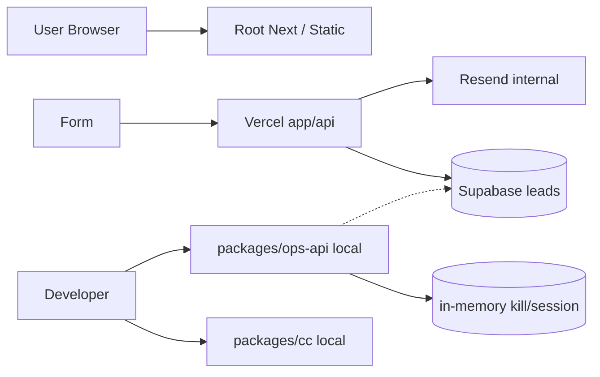

# DTH-M9 — Canonical Runtime Architecture

STATUS=PASS (provisional; hardened by M9R — freeze pending Owner; uncommitted)  
AS_OF_UTC=2026-08-13T06:30:00Z  
BASELINE_HEAD=4545c7b95ede83c952b7086f8073b19b747f20af  
SELECTED=DTH-ERA-A Evolutionary Dual-Plane  
COMMITTED=NO  
IMPLEMENTATION=NO  

## 1. Pre-Flight

```text
HEAD=4545c7b95ede83c952b7086f8073b19b747f20af
BRANCH=feat/deintarifheld-production-cutover-001
WORKTREE=CLEAN
M8C=PASS
M6=OPEN
M9_PRE_FLIGHT=PASS
```

## 2. Repository Runtime Reality (OBSERVED)

| Path | Purpose | Prod | Local Ops | Skeleton | Decision |
|---|---|---|---|---|---|
| `app/` + root Next | Public website | YES | — | NO | KEEP canonical public |
| `app/api/leads|careers|cron|admin` | Public intake/admin/cron | YES | — | NO | KEEP; constrain credentials later |
| `lib/leads/*` | Supabase+Resend+validation | YES | — | NO | KEEP on public plane |
| `packages/web` | Placeholder | NO | NO | YES | DEPRECATE |
| `packages/api` | Placeholder | NO | NO | YES | DEPRECATE |
| `packages/ops-api` | Ops BFF | NO | YES | NO | CANONICAL Ops API |
| `packages/cc` | CC UI + passkey gate | NO | YES | NO | CANONICAL CC |
| `packages/shared` | Contracts/JWKS/kill/session | NO | YES | Partial markers | CANONICAL shared lib |
| `packages/db` | Drafts + helpers | NO | YES | Drafts | Design source; apply via supabase |
| `packages/workers` | Stub worker | NO | YES | Stub | CANONICAL worker home |
| `supabase/migrations/001-002` | Public leads | YES path | — | NO | Public migration set |
| `supabase/migrations/003-013` | Ops foundation | LOCAL_APPLY | YES | — | Ops migration set |
| In-memory session/kill | Control state | NO | YES | — | REPLACE for prod (ADR-007/008) |

Root does **not** import `@deintarifheld/*` (OBSERVED).

## 3. Current Architecture Diagram



## 4. Architecture Principles

All P1–P20 **ACCEPTED** (see `02_ARCHITECTURE.md`). None rejected.

## 5. Trust-Zone Matrix

| Zone | Trust | Entrypoint | AuthN | AuthZ | Data | Writes | Credential | Audit |
|---|---|---|---|---|---|---|---|---|
| A Public Web | Untrusted | CDN/static | None | N/A | Public content | None | None | Low |
| B Public Intake API | Low | HTTPS API | Abuse controls | Constrained insert | Intake fields | Insert/limited | Narrow intake | Intake events |
| C Ops API | High | Private URL | Clerk/person | Server AuthZ | Ops+controlled lead views | Domain writes | Ops DB roles | Full |
| D CC | High | Private URL | Passkey/Clerk | Via Ops API | Operator views | Via Ops API | No DB secret | UI+API |
| E Worker | High | Internal | Service principal | Job+capability | Job scope | Outbox/claim | Worker DB role | Job audit |
| F Database | Critical | Private | DB auth | RLS+grants | All | Per principal | Per role | DB logs |
| G Providers | External | APIs | Provider keys | Adapter policy | Necessary payloads | Provider side | Scoped keys | Readback |
| H Agent | Untrusted compute | Tools | Agent principal | Tool policy | Minimized | Via Ops only | No infra secrets | Execution audit |

## 6. Principal Matrix (target)

| Principal | IdP | AuthZ | Impersonate human | Bypass RLS | External send | Customer data | Audit |
|---|---|---|---|---|---|---|---|
| PERSON | Clerk | Roles/capabilities | NO | NO | Via policy | Assigned scope | YES |
| SERVICE | Secrets/OIDC | Fixed capabilities | NO | Only if explicit role | Limited | Least privilege | YES |
| WORKER | Service | Job capabilities | NO | Claim role only | Via adapters | Job payload | YES |
| AGENT | Agent identity | Tool allowlist | NO | NO | Policy only | Minimized tool IO | YES |
| SYSTEM | Internal | Maintenance | NO | Migration runner only | NO | As needed | YES |
| BREAK_GLASS | Special | Time-boxed | NO | Explicit emergency | Controlled | Audited | MANDATORY |

## 7. Credential Matrix (target — no secret values)

| Runtime | Credential class | Bypass RLS? | R/W | External | Prod only? |
|---|---|---|---|---|---|
| Public Web | None | N/A | — | — | — |
| Public Intake API | `intake_writer` (narrow) | Prefer NO / limited | Insert intake | Mail optional separate | YES keys |
| Ops API | `ops_app` | NO (use RLS+AuthZ) | Ops R/W | No raw provider | YES |
| CC | None to DB | — | via Ops API | — | — |
| Worker | `worker_claimer` | Limited claim tables | Job R/W | Provider adapters | YES |
| Scheduler | Same as worker or cron secret | — | Enqueue | — | YES |
| Mail adapter | Resend scoped | N/A | — | Send | YES |
| Calendar | Calendar scoped | N/A | — | Calendar | YES |
| Agent | No DB/provider admin | NO | Tools only | Via Ops | YES |
| Monitoring | Read metrics | NO | Read | — | — |
| Migration runner | `migrator` | YES temporarily | DDL | NO | Controlled |

**Challenge result:** Unrestricted `service_role` for public intake is **not** the target end-state. Current prod may still use it until an implementation tranche migrates to narrow grants (no change now).

## 8–9. Runtime Options & Scorecard

Weights (sum emphasis on safety/simplicity):  
Security 5, Privacy 4, LeastPrivilege 5, OpsComplexity 5, MigrationRisk 5, Downtime 4, Rollback 4, Debug 3, Audit 4, Test 3, Deploy 3, Scale 2, MultiInstance 4, Workflow 4, Agent 3, Recovery 4, LockIn 2, Cost 3, TeamSize 5, Reuse 3, DebtReduction 3.

Scores 1–5 (higher better; for OpsComplexity/MigrationRisk/Downtime/Cost/LockIn: 5=simplest/safest/lowest):

| Criterion | W | A Dual-plane | B Full package consol. | C Single Next monolith |
|---|---|---|---|---|
| Security boundary | 5 | 5 | 4 | 2 |
| Privacy | 4 | 4 | 4 | 2 |
| Least privilege | 5 | 5 | 4 | 2 |
| Ops complexity | 5 | 4 | 3 | 3 |
| Migration risk | 5 | 5 | 2 | 2 |
| Downtime | 4 | 5 | 2 | 2 |
| Rollback | 4 | 5 | 2 | 2 |
| Debug | 3 | 4 | 3 | 3 |
| Audit | 4 | 4 | 4 | 3 |
| Test | 3 | 4 | 3 | 3 |
| Deploy | 3 | 3 | 3 | 4 |
| Scale | 2 | 3 | 3 | 2 |
| Multi-instance | 4 | 4 | 4 | 3 |
| Workflow | 4 | 4 | 4 | 3 |
| Agent | 3 | 4 | 4 | 2 |
| Recovery | 4 | 4 | 3 | 2 |
| Lock-in | 2 | 4 | 4 | 4 |
| Cost | 3 | 4 | 3 | 4 |
| Team size | 5 | 5 | 2 | 3 |
| Reuse | 3 | 4 | 3 | 4 |
| Debt reduction | 3 | 3 | 4 | 2 |
| **Weighted total** | | **≈292** | **≈232** | **≈198** |

## 10. Selected Architecture

```text
ARCHITECTURE_ID=DTH-ERA-A
ARCHITECTURE_NAME=Evolutionary Dual-Plane
RATIONALE=Preserves working public production; places Ops/workflow/agents on packages plane; minimizes migration and blast radius; rejects aesthetics-driven move into empty skeletons.
```

## 11. Rejected

- **B Full consolidation into packages/web|api:** high migration/downtime; skeletons empty; no security win.  
- **C Single Next for public+Ops permanently:** couples trust zones; shared compromise/deploy blast radius; weaker agent isolation.

## 12. Target Architecture Diagram

See `02_ARCHITECTURE.md`.

## 13–16. Decisions (summary)

| Topic | Decision |
|---|---|
| Public runtime | Root Next + current public APIs |
| Ops runtime | packages ops-api/cc/workers/shared/db |
| CC | Separate deployable UI → Ops API only |
| Ops API | Canonical domain+BFF gateway |
| Public→Ops | Durable intake + async outbox/worker |
| DB access | No browser/agent→DB |
| Credentials | Explicit matrix; narrow intake; no agent service_role |
| Session | Postgres-backed DTH registry + Clerk IdP |
| Kill | Postgres-backed; automation fail-closed; public independent |
| Workflow | Postgres + worker first |
| Agent | Tools→policy→AuthZ only |
| External actions | Outbox + readback + idempotency |
| Environments | LOCAL/TEST/STAGING/PROD separated; no prod PII in staging |

## 17–25. Detail

Covered in ADR-004…015 and `02_ARCHITECTURE.md`.

### Public intake critical path (must stay)

```text
Form → Public API validation/abuse checks → durable intake write → 2xx
```

Must **not** require: CC, AI, Calendar, Agent, Kill store, Ops API availability.

### Failure domains (abbrev.)

| Failure | Public | Ops | Data loss? |
|---|---|---|---|
| Public API down | Intake fails | Unaffected | No if client retries |
| Ops API down | Intake OK | Ops degraded | No if outbox durable |
| Worker down | Intake OK | Async lag | No; backlog |
| DB down | Intake fails | Ops fails | Risk — backups/RPO M10 |
| IdP down | Public OK | Login fails | No |
| Mail provider down | Intake OK | Comms lag | No if outbox |
| Session store down | Public OK | Enforce fail-closed for Ops sessions | No |
| Kill store down | Public OK | Automation fail-closed | No |

### Blast radius (abbrev.)

| Compromise | Max impact (target) |
|---|---|
| Intake credential | Insert/spam intake only — not full customer dump |
| Ops API credential | Ops data within AuthZ bugs — mitigated by RLS+AuthZ |
| Worker | Job-scoped actions + provider adapters |
| Agent | Tool allowlist only |
| Unrestricted service_role (legacy) | Full DB — **must be retired from broad use** |
| Clerk admin | Identity plane — tightly held, never in agents |
| Mail key | Send as brand — suppression/policy still required |

## 29. Technical Privacy Review

**Strengths:** Dual trust zones; agent data minimization path; staging without prod PII; audit/correlation planned.  
**Risks:** Current service_role breadth; logging payloads; backup copies (M10).  
**M10 must decide:** SoT, retention, lead→case fields, lineage/deletion propagation.

## 30. Migration Strategy

| Stage | Changes | Remains | Prod impact | Exit |
|---|---|---|---|---|
| CURRENT | Dual plane unresolved | Public LIVE | — | M8C |
| T1 | ADR freeze; deprecate skeletons in docs; Ops packages sole Ops home | Public unchanged | None | Owner accepts M9 |
| T2 | Staging; durable session/kill schema (M10); narrow intake role; outbox handoff | Public insert | Controlled | Staging E2E |
| TARGET | Dual-plane operated; agents via tools | Public stable | Low if strangler | Autonomy gates |

## 31. Deprecation Plan

| Component | Why | Replaced by | Safe removal |
|---|---|---|---|
| packages/web | Empty skeleton | Root public | After ADR accepted + no imports |
| packages/api | Empty skeleton | Root app/api | Same |
| In-memory session/kill in prod path | Unsafe | Postgres control tables | When durable stores live |
| Unscoped service_role for intake | Blast radius | intake_writer | After grant migration proven |

## 32. M9/M10 Boundary

**M9 decided:** runtimes, deploy/trust/credential/session/kill/workflow/agent/outbox/env/audit architecture classes.  
**M10 must decide:** tables, SoT, schemas, lead→case semantics, retention, detailed migration SQL, whether separate DB projects.

## 33. Invariants

Listed in `02_ARCHITECTURE.md`.

## 34. ADRs

`docs/architecture/adr/ADR-001` … `ADR-016` created (PROPOSED).

## 35. Open Risks

R-SVC, R-SESS, R-KILL, R-DUAL (now decided direction), R-MIG (ownership clarified; schema TBD M10), R-MAP, R-AUTHZ, R-RLS, R-STG, M6 historical — unchanged blockers for later phases.

## 36. Implementation Blockers

| Gate | Class |
|---|---|
| Owner accept M9 ADRs | BLOCKING_BEFORE_M9_CLOSE |
| M10 SoT/data architecture | BLOCKING_BEFORE_IMPLEMENTATION of handoff/schema |
| Persistent mapping + Strong AuthZ + RLS policies | BLOCKING_BEFORE_STAGING |
| Durable session/kill implemented | BLOCKING_BEFORE_PRODUCTION |
| M6 closure or Owner risk acceptance | BLOCKING_BEFORE_PRODUCTION_IDENTITY |
| Staging env | BLOCKING_BEFORE_STAGING |
| Agent runtime | BLOCKING_BEFORE_AUTONOMY |

## 37. M9 Gate

```text
M9=PASS
REASON=Repo audited; principles set; ≥3 options scored; DTH-ERA-A selected; trust/principal/credential matrices defined; handoff/session/kill/workflow/agent/outbox/env/audit decided; M9/M10 boundary explicit; ADRs written; red-team found no architecture-rejecting residual that forces another option; no implementation.
```

Red-team: all critical questions addressed as **MITIGATED_BY_REQUIRED_CONTROL** or **PROVEN_BY_DESIGN_SAFE** for target; current prod service_role remains **OPEN_RISK** until implementation (not rejecting dual-plane choice).

## 38. Repository State

```text
HEAD=4545c7b (until docs saved — will be dirty governance only)
SOURCE_CODE_CHANGED=NO
COMMIT_CREATED=NO
PUSH_EXECUTED=NO
```

## 39. Recommended Next

```text
RECOMMENDED_NEXT_TRANCHE=DTH-M10_CANONICAL_DATA_AND_SOURCE_OF_TRUTH_ARCHITECTURE
```

After Owner review of M9. No auto-commit.

## M9F FREEZE NOTE

STATUS remains PASS. Frozen by DTH-M9F. No reinterpretation. Implementation gaps remain OPEN until later tranches.
